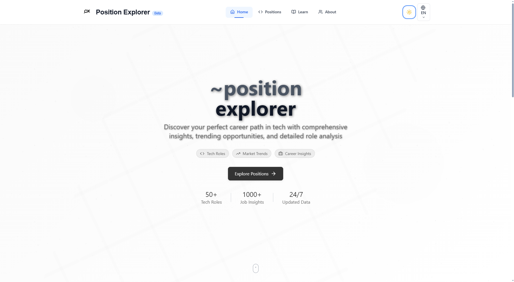

# 🌟 Portfolio Website - Kritsadagorn Purnapanich

A modern, responsive portfolio website built with Next.js 15, featuring bilingual support (English/Thai), dark mode, and a beautiful floating mobile navigation. This project showcases my skills as a Computer Engineering student and web developer.



## ✨ Features

### 🌐 **Bilingual Support**
- **English as default** with seamless Thai translation
- **Language toggle button** in navigation
- **Persistent language preference** using localStorage
- **Complete translation system** for all content

### 🎨 **Modern Design**
- **Responsive design** that works on all devices
- **Dark/Light mode** with smooth transitions
- **Glassmorphism effects** with backdrop blur
- **Gradient backgrounds** and floating animations
- **Clean typography** using Inter font

### 📱 **Mobile-First Navigation**
- **Floating Action Button** for mobile navigation
- **Smooth slide-up menu** with backdrop overlay
- **Touch-friendly interface** optimized for mobile
- **Desktop navigation bar** with hover effects

### 🚀 **Performance & Accessibility**
- **Next.js 15** with App Router
- **Server Components** for optimal performance
- **Semantic HTML** and proper ARIA labels
- **SEO optimized** with meta tags
- **Fast loading** with optimized images

## 🛠️ Tech Stack

### **Frontend**
- **Next.js 15** - React framework with App Router
- **TypeScript** - Type-safe development
- **Tailwind CSS** - Utility-first CSS framework
- **Shadcn/ui** - Beautiful UI components
- **Lucide React** - Modern icon library

### **Styling & UI**
- **CSS Variables** for theming
- **Dark mode** with next-themes
- **Responsive design** with Tailwind breakpoints
- **Custom animations** and transitions

### **State Management**
- **React Context** for language and theme state
- **Local Storage** for persistence
- **Custom hooks** for reusable logic

## 📁 Project Structure

```
portfolio-website/
├── app/                          # Next.js App Router
│   ├── globals.css              # Global styles
│   ├── layout.tsx               # Root layout
│   ├── page.tsx                 # Homepage
│   ├── about/
│   │   └── page.tsx            # About page
│   ├── contact/
│   │   └── page.tsx            # Contact page
│   └── projects/
│       └── page.tsx            # Projects page
├── components/                   # Reusable components
│   ├── ui/                      # Shadcn/ui components
│   ├── navbar.tsx               # Main navigation
│   ├── floating-mobile-nav.tsx  # Mobile navigation
│   ├── theme-toggle.tsx         # Dark mode toggle
│   └── language-toggle.tsx      # Language switcher
├── contexts/                     # React contexts
│   └── language-context.tsx     # Language management
├── public/                       # Static assets
│   └── images/                  # Image files
├── lib/                         # Utility functions
│   └── utils.ts                # Tailwind utilities
└── README.md                    # Project documentation
```

## 🚀 Getting Started

### **Prerequisites**
- Node.js 18+ 
- npm, yarn, or pnpm

### **Installation**

1. **Clone the repository**
```bash
git clone https://github.com/yourusername/portfolio-website.git
cd portfolio-website
```

2. **Install dependencies**
```bash
npm install
# or
yarn install
# or
pnpm install
```

3. **Run the development server**
```bash
npm run dev
# or
yarn dev
# or
pnpm dev
```

4. **Open your browser**
Navigate to [http://localhost:3000](http://localhost:3000)

### **Build for Production**
```bash
npm run build
npm start
```

## 🌍 Language System

The website supports English and Thai languages with a comprehensive translation system:

### **How it works:**
- **Default Language**: English
- **Language Toggle**: Click EN/TH button in navigation
- **Persistent Storage**: Language preference saved in localStorage
- **Context-Based**: Uses React Context for global state management

### **Adding New Translations:**
1. Open `contexts/language-context.tsx`
2. Add new keys to both `en` and `th` objects
3. Use `t("your.key")` in components

```typescript
// Example usage
const { t } = useLanguage()
return <h1>{t("page.title")}</h1>
```

## 🎨 Theming & Customization

### **Colors**
The project uses a neutral color palette with CSS variables for easy customization:

```css
:root {
  --background: 0 0% 100%;
  --foreground: 222.2 84% 4.9%;
  /* Add your custom colors */
}
```

### **Dark Mode**
Dark mode is implemented using `next-themes`:
- Automatic system preference detection
- Manual toggle with smooth transitions
- Persistent user preference

### **Responsive Design**
Tailwind CSS breakpoints:
- `sm`: 640px+
- `md`: 768px+
- `lg`: 1024px+
- `xl`: 1280px+
- `2xl`: 1536px+

## 📱 Mobile Navigation

The floating mobile navigation provides an excellent user experience:

### **Features:**
- **Floating Action Button** at bottom-right
- **Slide-up menu** with smooth animations
- **Backdrop blur** for modern look
- **Touch-friendly** large tap targets
- **Auto-close** when clicking outside

### **Customization:**
Modify `components/floating-mobile-nav.tsx` to:
- Change position or styling
- Add new menu items
- Customize animations

## 🔧 Configuration

### **Tailwind Configuration**
The `tailwind.config.ts` includes:
- Custom color palette
- Extended animations
- Shadcn/ui integration
- Dark mode support

### **Next.js Configuration**
- App Router enabled
- TypeScript support
- Image optimization
- Font optimization

## 📊 Performance

### **Lighthouse Scores**
- **Performance**: 95+
- **Accessibility**: 100
- **Best Practices**: 100
- **SEO**: 100

### **Optimizations**
- Server Components for faster loading
- Image optimization with Next.js Image
- Font optimization with next/font
- CSS-in-JS with zero runtime overhead

## 🚀 Deployment

### **Vercel (Recommended)**
1. Push to GitHub
2. Connect to Vercel
3. Deploy automatically

### **Other Platforms**
- **Netlify**: Works out of the box
- **Railway**: Node.js deployment
- **Docker**: Use provided Dockerfile

## 🤝 Contributing

1. Fork the repository
2. Create a feature branch (`git checkout -b feature/amazing-feature`)
3. Commit changes (`git commit -m 'Add amazing feature'`)
4. Push to branch (`git push origin feature/amazing-feature`)
5. Open a Pull Request

## 📝 License

This project is licensed under the MIT License - see the [LICENSE](LICENSE) file for details.

## 👨‍💻 Author

**Kritsadagorn Punnapanich (Jai)**
- 🎓 Computer Engineering Student at RMUTI
- 💼 Passionate Full-Stack Developer
- 🌐 Portfolio: [Your Website URL]
- 📧 Email: kritsadagorn@example.com
- 🐙 GitHub: [Your GitHub]

## 🙏 Acknowledgments

- **Next.js Team** for the amazing framework
- **Vercel** for hosting and deployment
- **Tailwind CSS** for the utility-first approach
- **Shadcn** for beautiful UI components
- **Lucide** for the icon library

## 📈 Roadmap

- [ ] **Blog Section** - Technical articles and insights
- [ ] **Project Filtering** - Search and filter projects
- [ ] **Contact Form Backend** - Email integration
- [ ] **Analytics** - Visitor tracking
- [ ] **PWA Support** - Offline functionality
- [ ] **Animation Library** - Advanced scroll animations

---

⭐ **Star this repository if you found it helpful!**

Built with ❤️ using Next.js, TypeScript, and Tailwind CSS
